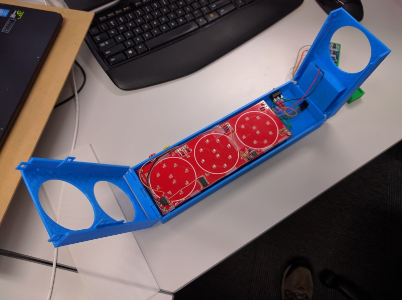

# Park Light

## Summary

Park Light is a parking sensor designed to be fixed to the wall of a garage.
It automatically activates when a car is detected, and as the car approaches transitions from green to yellow before transitioning to red at the point at which the car should stop.

It is able to be distance-calibrated by the user to suit their specific environment, and features battery saving capabilities to extend its life.

### Team Members

* [Merrick Heley](https://github.com/MerrickHeley)
    * Project lead
	* Electronics
	* Software
* [Dasun Gunasinghe]()
	* Mechanical design
* [Jonathan Holland](https://github.com/JonathanHolland)
    * Software

## Hardware

This project uses an externally sourced HCSR04 distance sensor.

## Calibration

* Red button: Calibrate distance at which the yellow light will transition to a red light.
* Yellow button: Calibrate distance at which the green light will transition to a yellow light.

### Calibration responses

* Red light blinks 5 times: Calibration failed, readings not stable.
* Yellow light blinks 5 times: Calibration failed, calibration points are too close together.
* Green light blinks 5 times: Calibration successful.

## Errors

* Current state flashing: Low battery.
* Centre LED's flashing: Sensor not connected or is not returning valid data.

## Finished Product

